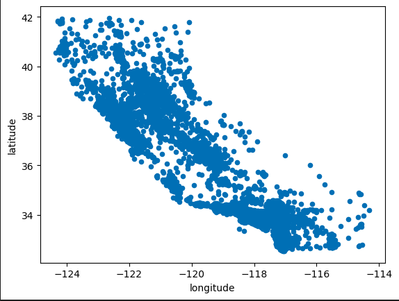
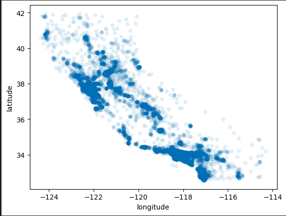
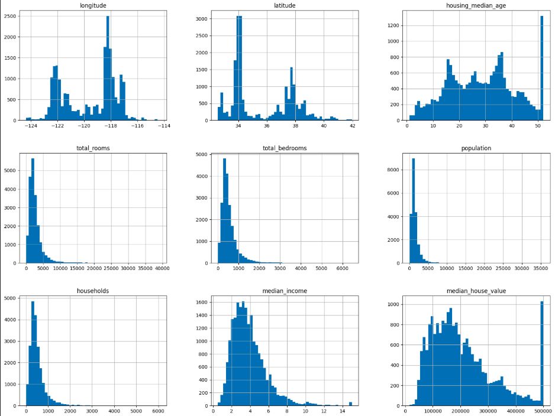
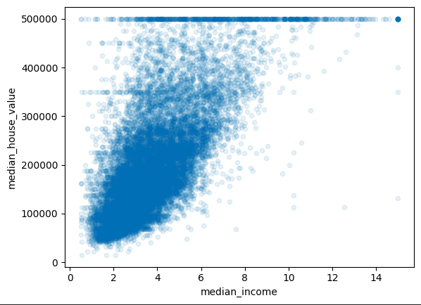
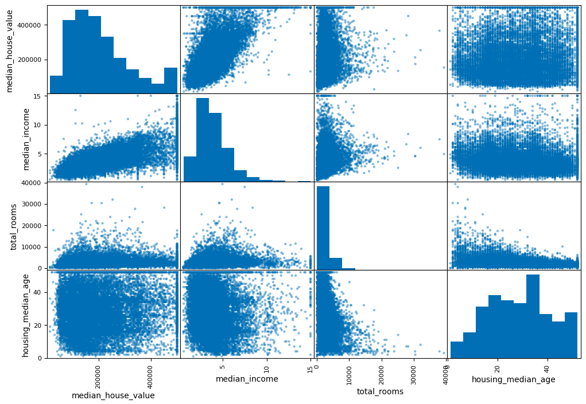

# 🏡 California Housing Price Predictor

---

## 🔍 Project Overview

The **California Housing Price Predictor** is a **machine learning project** that predicts **median house values** across California districts using **housing, demographic, and geographical features**.  

By leveraging real-world data and predictive modeling, this project provides **data-driven insights** into California's housing market and highlights the most influential factors affecting property prices.  

Key features used:  

- 🏘️ **Housing Median Age**  
- 🛏️ **Total Bedrooms**  
- 🛋️ **Total Rooms**  
- 👥 **Population**  
- 🏡 **Households**  
- 💰 **Median Income**  
- 🌍 **Latitude & Longitude**  
- 🌊 **Ocean Proximity**  

---

## 🛠️ Technologies Used

- **Python** – Programming language  
- **Libraries:** `pandas`, `numpy`, `matplotlib`, `seaborn`, `scikit-learn`  
- **Jupyter Notebook** – Development & visualization environment  

---

## 🧠 Machine Learning Workflow

1. **Data Exploration:** Analyze trends and correlations in the California housing dataset.  
2. **Data Preprocessing:** Handle missing values, encode categorical features, scale numerical data.  
3. **Feature Engineering:** Create features like `rooms per household` for better predictions.  
4. **Model Training:** Train **Linear Regression**, **Decision Tree**, and **Random Forest Regressor** models.  
5. **Evaluation:** Measure model performance using **RMSE** and **R² Score**.  
6. **Prediction & Insights:** Predict house prices for new data and determine feature importance.  

---

## 📊 Visual Insights

  
*Latitude VS Longitude of all the houses taken.*

  
*Mapping of the houses with population.*

  
*Mapping of the houses with population in colours.*

  
*Correlation of Parameters.*

  
*Median House Value VS Median Value.*

  
*Correaltion of Derived Data with Median Income.*

---

## 💡 Key Insights

- 💰 **Median income** strongly predicts house prices.  
- 🌊 Proximity to the **ocean** increases property value.  
- 🏘️ **Population density** and **rooms per household** also impact pricing.  
- 🛠️ Data preprocessing and feature engineering improve model performance.  

---

## 🚀 Future Enhancements

- Integrate **Deep Learning models** for higher accuracy.  
- Build a **Web Interface** using Flask or Streamlit for real-time predictions.  
- Add **Interactive Maps** with Plotly or Folium to explore price distributions. 
- Incorporate additional data like **school ratings** and **economic indicators**.  

---

## 📂 Repository Structure
California-Housing-Price-Predictor/
- │
- ├─ data/ # Dataset files
- ├─ notebooks/ # Jupyter notebooks for EDA & modeling
- ├─ models/ # Saved ML models
- ├─ graphs/ # Visualization outputs
- ├─ README.md # Project documentation
- └─ requirements.txt # Python dependencies

---

## 🤝 Contributing

Contributions are welcome! You can help by:  

- Improving the model  
- Adding new visualizations  
- Developing a web interface  
- Optimizing code for efficiency  

---

## 📌 License

This project is open-source and available under the **[MIT License](LICENSE)**.

---

✨ Feel free to ⭐ the repository if you find it useful!
